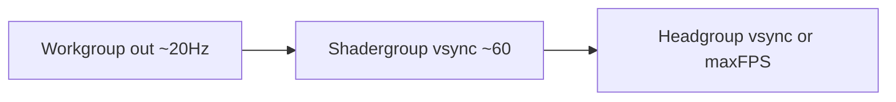

# Pipeline refresh rates (binding — 2026-08-11)

Status: **design lock from developer interview**. Not fully implemented.
Charter: headgroup/shadergroup pacing work needs an issue-stack note before
edits outside location+HUD.

## Goal

Whole-view output should feel like a **smooth, double-buffered, vsync-paced**
pipe. Actors must **never sit blocked waiting** on a channel: each holds an
**internal latest buffer** and **swaps** when a newer message arrives
(latest-wins). Upstream that runs faster than the next stage only creates
pressure the downstream must resolve — better to **align rates** so that
pressure is rare and the work per wake stays manageable.

## Three refresh rates

| Assembly | Cadence of its *output* | Notes |
|---|---|---|
| **Workgroup** (collector → shade) | **~20 Hz** | Matches the workgroup groove; answer packages need not stream at display rate. Integrating in the collector at this rate is fine. |
| **Shadergroup** (escaper → colorer → window) | **Vsync** (default **60 Hz** until real vsync rate is wired) | Entire shade path shares one consistent frame rate — effectively the rate of the slowest shade member, intentionally synced so nothing races ahead. Faster than vsync only pressures the next actor; slower than vsync means the display cannot show a smooth continuum of what came before. |
| **Headgroup** (window present) | **Vsync by default** | Optional **max frame rate** (typed number — allow weird divisors for the monitor) + **disable vsync** → run as fast as possible up to that max. Uncapped headgroup feels slightly more responsive for UI; shade/workgroup stay paced. |

## Actor shape (all three)

1. **Resident buffer** of the current whole-view (or package) the actor owns.
2. On input: **swap** to the newest; never block the sender (`try_send` /
   coalesce / undeliver as already law on display and work paths).
3. On wake: process **from the resident buffer** at the assembly’s cadence —
   not “as fast as the previous stage floods.”
4. Small channels stay small; persistent `drop:` still means “this stage is too
   slow for its cadence × resolution,” not “grow the ring.”

## Headgroup today (bug relative to this lock)

`window/mod.rs` sets `VSYNC = false` and calls `ctx.request_repaint()` every
frame — uncapped. That was excitement, not the intended default. Default must
return to vsync; uncapped belongs behind the max-FPS setting.

## Sync mechanism (preferred direction)

Prefer **one shared shade cadence** rather than each shade actor inventing its
own timer:

- **Default:** shade wakes at vsync period (placeholder 1/60 s) and consumes
  resident answers / values / colors.
- **Headgroup** presents on vsync (or max-FPS when uncapped).
- **Optional later:** headgroup emits a per-frame stencil (or frame tick) that
  *also* paces shade — only if timer-only shade proves desynced from present.
  Do not require “every stencil must force a full shade pass” until measured;
  latest-wins already allows shade to skip when nothing changed.

Workgroup publish stays on its own ~20 Hz groove; shade always has a resident
package to re-escape/recolor under animated bailout without needing 60 Hz
answer floods.

## Out of scope until this lands

- Auto gearbox picking GPU color/escape.
- Merging shade wgpu with naive_gpu device.
- Changing workshift internal bout timing (only the **collector publish**
  cadence is the 20 Hz claim here).

## Verify when implemented

- Settings: max FPS + vsync toggle on headgroup; shade period defaults 60.
- Headed: default = vsync-smooth; uncapped max FPS feels snappier on UI only.
- HUD / steady_state: shade `drop:` not climbing unboundedly at default res
  under bailout anim; workgroup publish rate near 20 Hz.
