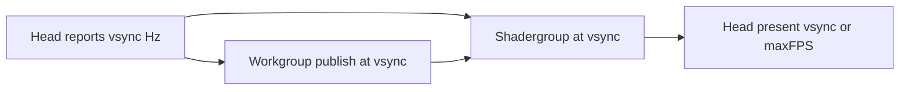

# Pipeline refresh rates (binding — 2026-08-11)

Status: **design lock from developer interview** (revised same day). Not
implemented. No code until a later “big plan” of undiscussed work. Charter:
headgroup/shadergroup pacing edits need an issue-stack note.

## Goal

Whole-view stages should feel like a **smooth, double-buffered, vsync-paced**
pipe. Actors **never block waiting** on the next stage: each holds an
**internal latest buffer** and **swaps** when newer input arrives.

## Two tiers (revised)

| Tier | Who | Cadence | Role |
|---|---|---|---|
| **Content / continuum** | Workgroup *publish* (collector → shade), entire shadergroup | **Real monitor vsync period** (communicated from head/egui — **not** a hardcoded 60) | Video-like: bailout/color anims. Even ~20 Hz can feel OK if responsive; pain starts around **≲15 Hz** (worse ≲10). |
| **UI / feel** | Headgroup present | **Vsync by default**; optional typed **max FPS** + **disable vsync** → as fast as possible up to max | Game-like: uncapped head can feel snappier; content tier stays on vsync. |

Hardcoding “60 FPS” for shade/workgroup is a **shoddy quick fix** — rejected.
Head must expose the egui/monitor vsync rate (or period) so content actors
share the **same** number.

### Workgroup publish

Collector emits **whatever work is done so far** on the vsync beat — not a
promise of a complete frame every interval. Full-frame every N ms is aspirational,
not part of the design contract.

### Shadergroup

Runs at the **same vsync** as content. Animations are closer to video than to
competitive FPS; matching vsync is enough. Head may go higher; shade should not
chase uncapped head.

### Escape gear

**OG remains default** — developer reports GPU escape is currently slower.

## Actor wake shape

**Lean toward per-actor timers** (`wait_periodic` at the shared vsync period),
not “pace only when a channel message arrives.” Channels still deliver *data*
(latest-wins swap); timers deliver *intent to produce a frame* from the
resident buffer (needed for bailout/color anim when no new package arrives).

Graceful property to preserve: Steady State lets a **later** actor keep a good
rate even if an **earlier** one is sick (e.g. bailout anim rough, color-layer
anim still smooth) — because each has its own wake + resident buffer. Ideal
steady state is still **everyone on the same vsync**; independence is the
degraded case, not the goal to optimize for.

### Steady-state stack read (timers vs channels)

From `steady-state-stack` manifesto / philosophy:

- **Pull-reactor:** progress = consumer **intent** + resource available; idle ≈
  0% CPU until a registered condition fires.
- **Single wake-up:** consolidate channel *and* timer waits at one
  `await_for_any!` / `await_for_all!` point — timers are first-class wake
  sources, not a smell.
- Bundle lessons race `wait_periodic` heartbeats with index/channel waits —
  idiomatic.

So: **timer for cadence + channel for data swap** matches the framework.
Pacing *only* via channel push would couple sick upstream to silent downstream
(no anim wake) and fight “later actors can still do well.”

## Headgroup today (bug relative to this lock)

`window/mod.rs`: `VSYNC = false` + every-frame `request_repaint()` — uncapped.
Default must return to vsync; uncapped only behind max-FPS setting. While
fixing, also **publish vsync Hz/period** to content actors (mechanism TBD in
interview — settings broadcast already exists).

## Out of scope until the big plan

- Implementing any of the above (developer: hold code; later one large plan).
- Auto gearbox picking GPU shade.
- Shade↔naive_gpu device merge.
- Changing workshift bout timing (only **publish** cadence is in scope here).

## Verify when eventually implemented

- Content actors share head-reported vsync period (not a magic 60).
- Head: vsync default; max FPS + disable vsync works.
- Headed: content ≲15 Hz is the failure smell; uncapped head does not force
  shade to match.
- Escape default stays OG until GPU escape wins on wall time.
